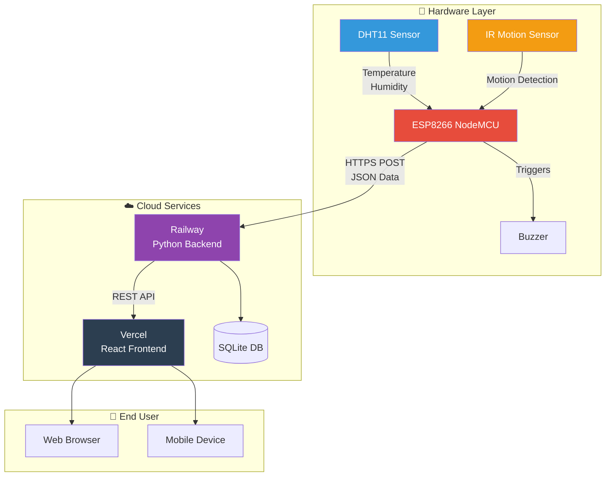
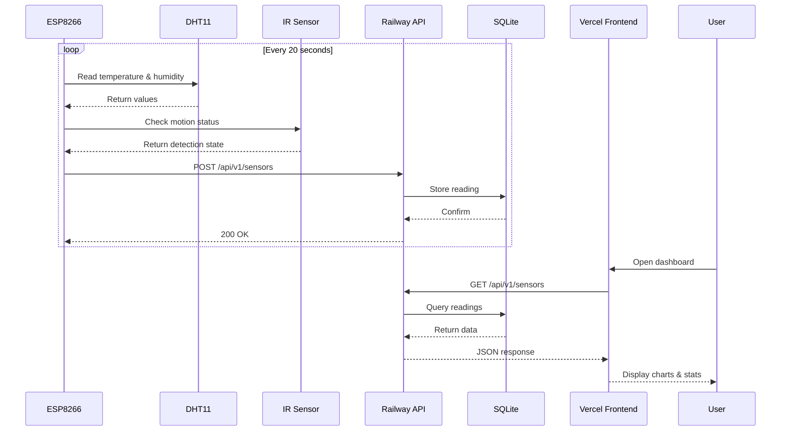

# 🌡️ IoT Sensor Monitoring System

A real-time IoT sensor monitoring system using ESP8266, DHT11 temperature/humidity sensor, and IR motion detection. Data is visualized on a web dashboard deployed to the cloud.

## 🌐 Live Demo

| Component | URL |
|-----------|-----|
| **Frontend (Dashboard)** | [https://final-project-mauve-ten.vercel.app](https://final-project-mauve-ten.vercel.app) |
| **Backend (API)** | [https://final-project-production-57c6.up.railway.app](https://final-project-production-57c6.up.railway.app) |
| **API Endpoints** | [/api/v1/sensors](https://final-project-production-57c6.up.railway.app/api/v1/sensors) |

---

## 📊 System Architecture



---

## 🔌 Hardware Components

### ESP8266 NodeMCU
- **Microcontroller**: ESP8266 (32-bit, 80MHz)
- **WiFi**: 802.11 b/g/n
- **Flash**: 4MB
- **Operating Voltage**: 3.3V
- **Digital I/O Pins**: 17

### DHT11 Temperature & Humidity Sensor
| Specification | Value |
|---------------|-------|
| Temperature Range | 0-50°C |
| Temperature Accuracy | ±2°C |
| Humidity Range | 20-90% RH |
| Humidity Accuracy | ±5% RH |
| Sampling Rate | 1Hz |

### IR Motion Sensor (Obstacle Detection)
| Specification | Value |
|---------------|-------|
| Operating Voltage | 3.3V - 5V |
| Detection Range | 2-30cm |
| Output | Digital (HIGH/LOW) |
| Active State | LOW when obstacle detected |

### Buzzer
- **Type**: Active Buzzer
- **Voltage**: 3.3V - 5V
- **Triggers**: When IR sensor detects motion

---

## 🔗 Circuit Connections

```
ESP8266 NodeMCU Pinout:
┌─────────────────────────────────────┐
│                                     │
│   DHT11          IR Sensor          │
│   ┌───┐          ┌───┐              │
│   │ S ├──────────┤ D2│              │
│   │ + ├──────────┤3V3│              │
│   │ - ├──────────┤GND│              │
│   └───┘          └───┘              │
│                                     │
│   IR Sensor      Buzzer             │
│   ┌───┐          ┌───┐              │
│   │OUT├──────────┤ D6│              │
│   │VCC├──────────┤3V3│   ┌───┐      │
│   │GND├──────────┤GND│   │ + ├──D5  │
│   └───┘          └───┘   │ - ├──GND │
│                          └───┘      │
└─────────────────────────────────────┘
```

| Component | ESP8266 Pin |
|-----------|-------------|
| DHT11 Data | D2 |
| IR Sensor OUT | D6 |
| Buzzer + | D5 |
| VCC (All) | 3.3V |
| GND (All) | GND |

---

## 📁 Project Structure

```
final-project/
├── arduino/
│   └── sensor_esp8266.ino    # ESP8266 firmware
│
├── backend/
│   ├── app/
│   │   ├── __init__.py
│   │   ├── main.py           # FastAPI application
│   │   ├── database.py       # SQLAlchemy setup
│   │   ├── models.py         # Database models
│   │   ├── schema.py         # Pydantic schemas
│   │   └── api/
│   │       ├── __init__.py
│   │       └── routes.py     # API endpoints
│   ├── requirements.txt
│   └── Procfile
│
├── frontend/
│   ├── src/
│   │   ├── App.tsx           # Main React component
│   │   ├── api.ts            # API client
│   │   ├── index.css         # Styles
│   │   └── components/
│   │       ├── SensorList.tsx
│   │       ├── SensorForm.tsx
│   │       ├── SensorChart.tsx
│   │       └── LiveStats.tsx
│   ├── package.json
│   └── vite.config.ts
│
├── render.yaml               # Render deployment config
└── README.md
```

---

## 🚀 Deployment

### Frontend - Vercel
- **Platform**: [Vercel](https://vercel.com)
- **Framework**: React + Vite
- **Auto-deploy**: On push to `main` branch
- **URL**: https://final-project-mauve-ten.vercel.app

### Backend - Railway
- **Platform**: [Railway](https://railway.app)
- **Framework**: FastAPI + Uvicorn
- **Database**: SQLite (ephemeral)
- **Auto-deploy**: On push to `main` branch
- **URL**: https://final-project-production-57c6.up.railway.app

---

## 📡 API Endpoints

| Method | Endpoint | Description |
|--------|----------|-------------|
| `GET` | `/api/v1/sensors` | Get all sensor readings |
| `POST` | `/api/v1/sensors` | Create new sensor reading |
| `DELETE` | `/api/v1/sensors/{id}` | Delete a sensor reading |
| `GET` | `/` | Health check |

### Request Body (POST /api/v1/sensors)
```json
{
  "temperature": 25.5,
  "humidity": 65.0,
  "predicted_temperature": 26.0,
  "ir_detected": false
}
```

### Response
```json
{
  "id": 1,
  "temperature": 25.5,
  "humidity": 65.0,
  "predicted_temperature": 26.0,
  "ir_detected": false,
  "timestamp": "2026-06-04T05:30:00Z"
}
```

---

## 🛠️ Local Development

### Backend
```bash
cd backend
pip install -r requirements.txt
uvicorn app.main:app --reload --port 8000
```

### Frontend
```bash
cd frontend
npm install
npm run dev
```

### Arduino
1. Open `arduino/sensor_esp8266.ino` in Arduino IDE
2. Install libraries:
   - ESP8266WiFi
   - ESP8266HTTPClient
   - DHT sensor library
3. Update WiFi credentials in the code
4. Select Board: **NodeMCU 1.0 (ESP-12E Module)**
5. Upload to ESP8266

---

## 📈 Data Flow



---

## ⚡ Features

- ✅ Real-time temperature monitoring
- ✅ Humidity tracking
- ✅ IR motion detection with buzzer alert
- ✅ Predicted temperature calculation
- ✅ Live dashboard with auto-refresh
- ✅ Historical data visualization
- ✅ Responsive web design
- ✅ Cloud-deployed (always accessible)
- ✅ Auto-reconnect on WiFi loss
- ✅ Error handling & fallback values

---

## 🔧 Configuration

### WiFi Settings (Arduino)
```cpp
const char* ssid = "Your_WiFi_Name";
const char* password = "Your_WiFi_Password";
```

### Backend URL (Arduino)
```cpp
const char* backendUrl = "https://final-project-production-57c6.up.railway.app/api/v1/sensors";
```

### Environment Variables

**Backend (Railway)**:
| Variable | Value |
|----------|-------|
| `DATABASE_URL` | `sqlite:///./sensor.db` |
| `FRONTEND_URL` | `https://final-project-mauve-ten.vercel.app` |

**Frontend (Vercel)**:
| Variable | Value |
|----------|-------|
| `VITE_API_URL` | `https://final-project-production-57c6.up.railway.app` |

---

## 📷 Screenshots

### Dashboard
The web dashboard displays:
- Current temperature and humidity
- Average readings
- Min/Max ranges
- Total readings count
- Real-time chart
- Sensor reading history with IR detection status

### IR Detection Alert
When motion is detected:
- Buzzer sounds on ESP8266
- Dashboard shows red "Detected!" badge with pulse animation
- Reading is immediately sent to server

---

## 🤝 Tech Stack

| Layer | Technology |
|-------|------------|
| **Hardware** | ESP8266, DHT11, IR Sensor |
| **Firmware** | Arduino C++ |
| **Backend** | Python, FastAPI, SQLAlchemy |
| **Frontend** | React, TypeScript, Vite |
| **Styling** | CSS3 |
| **Database** | SQLite |
| **Hosting** | Vercel (Frontend), Railway (Backend) |

---

## 📝 License

MIT License - Feel free to use this project for learning and development.

---

## 👩‍💻 Author

Built as a final project demonstrating IoT + Full-stack development.

**Live URLs**:
- 🌐 Dashboard: https://final-project-mauve-ten.vercel.app
- 🔌 API: https://final-project-production-57c6.up.railway.app/api/v1/sensors